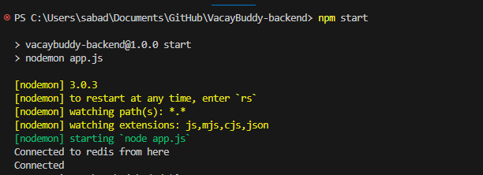

# VacayBuddy-backend

## Table of Contents

- [Introduction](#introduction)
  - [Objective](#objective)
  - [Motivation](#motivation)
  - [Scope](#scope)
    - [Features](#features)
  - [Techstack](#techstack)
- [Installation](#installation)

## Introduction

### Objective

The primary objective of the project is to develop a comprehensive tour management system that provides easy and user friendly service to book travel transportations, accommodations and tour itineraries. 

### Motivation

Tourism is a vastly growing industry in the digital age. In the year 2022, travel and tourism contributed about 7.7 trillion US dollars to GDP worldwide and the number is only projected to increase in the coming decade. The United States is by far one of the leading contributors to tourism GDP, employing more than 5 million people in the tourism industry according to statistics from 2022. While there are plethora of tour management systems and travel agencies available on the internet, it is intimidating for users to find cost efficient and logistically optimized holiday plans that also cater to their niche requirements. Moreover in a traditional booking route, users have to hop on multiple websites to book their flights and hotels and attraction sights, and have to rely on third party travel blog sites to plan non-conventional/rural/niche themed sightseeing tours. This can be quite a hassle and impact tourism sales due to lack of customer convenience. These issues need to be addressed in order to provide users a seamless and convenient boooking experience. 

### Goal

VacayBuddy's goal is to provide our users a centralized platform which seamlessly streamlines all the travel formalities such as booking flights, searching hotels, identifying sightseeing places and restaurants, and building customized itineraries suited to their travel and budget needs with visual map aid. Additionally, users can connect with audiences with similar travel itineraries and shared interests in the website’s community forums which allows them to look for travel buddies. 

The platform endeavors to establish seamless connections between users and a curated network of airlines, hotels, and local enterprises, who have a shared interest in making their holiday experience safe, relaxing and memorable. This will in turn have a positive impact on the tourism industry sales, and increase their popularity and brand image in the service industry. One of our primary goals is also to utilize this platform in promoting local/small businesses in tourist destination cities who are often overshadowed in mainstream tour packages. 

#### Features

The features of this booking platform include:

1. User Platform - 
    - Users can set up a personal profile and explore travel destinations around the world. 
    - Booking facility for transportation, travel accommodations, restaurants and local sightseeing tours. 
    - Users can build customized itineraries and share with fellow travelers in community forms. 
    - Users can rate and review hotels, restaurants and sightseeing places, and see cumulative ratings of the services by other users.
    - A blog interface for users/travel bloggers to blog their travel experiences and recommendations. 

2. Flight booking service 

    - Fight search service which allows users to search for flights by providing the origin, destination, and travel dates. 
    - Flight comparison service which allows users to compare different flights based on factors such as price, duration and layovers.
    - Flight booking service which allows users to reserve a flight and provide personal and payment details using a payment gateway service. 

3. Itinerary building service
    - Users can search for famous restaurants, local shops and sightseeing tours according to their interests and build an itinerary plan with day wise things to do. 
    - Users can view sightseeing places on a map to get visual understanding of the travel plan. 
    - Dynamic recommendations of places according to the user's interests and current items in the itinerary. 
    - Users can share itineraries with fellow users in community forums.

4. Search and Recommendation Engine

    - Search things to do, restaurants, hotels, and flights to travel destinations inputted by the user with autocomplete feature.
    - Apply filters of price, duration, layover, ratings, proximity to airports, etc in the search.  Cache these options as users’ recent searches for search optimization.
    - Travel recommendation engine  that recommends the best hotels, restaurants and sightseeing places according to the user's interests, itinerary plan and popularity. 

5. Admin platform 

    - Administrative access to user profiles and booking history and ability to aid users with booking/payment/login issues. 
    - Maintain a financial ledger of user bookings and payment activity. Monitor financial transactions and ensure verification and security of bookings. Handle invoicing and payments to business partners.
    - Analytic tools to track website performance, user behavior, and booking trends in order to generate dashboard reports for strategic decision making.
    - Access to the database of city’s description, images, tourism and transportation facilities. Ensure content is accurate and up to date.

### TechStack

1. Backend: Node.js, Express.js
2. Frontend: HTML, CSS, Javascript, JQuery, Bootstrap, React.js
3. Database: MongoDB, AWS S3 for Images
4. Containerization: Docker, Kubernetes
5. Caching and Optimization: Redis, CDN, Sessions & Cookies
6. Miscellaneous: REST APIs, Stripe API for Payment Gateway, SendGrid for notifications


### Installation

Follow these steps to install and set up the project locally.

#### Prerequisites

Before you begin, ensure you have met the following requirements:

1. Active MongoDB database. Access connection URL on MongoDB Atlas.
2. Add your current IP address to IP access list. (Atlas -> Project -> Overview -> Security -> Network Access)
3. Active database on Redis Cloud. Access conenction details on Redis dashboard.


#### Instructions

## Using Local System

1. Clone the repository to your local machine using Git:

```bash
git clone https://github.com/juyee1698/VacayBuddy-backend.git
```

2. Navigate to the project directory and open the project in Visual Studio (or code editor of your choice). 

Install all the node dependencies. 
```bash
npm install
```

3. Create an .env file in source directory to add project's environment variables.

```bash
mongoose_connect="<mongodb-connection-url>"
redis_host="<redis-host-url>"
redis_port=<redis-port>
redis_password="<redis-password>"
```

4. Start the node project. 

```bash
npm start
```

Expected result on terminal:




## Using Docker 

1.Build Image
```bash
docker build -t  -f Dockerfile .
```
2. Run Image
```bash
docker run -p 8080:8080  
# run in backgorund
docker run -p 8080:8080 -d 
```
3. Login to container to debug
```bash
docker exec -it <container-id> /bin/sh
```

